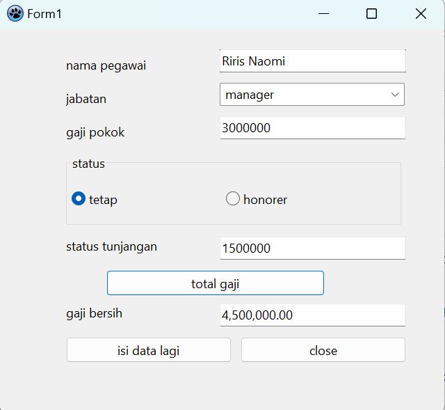
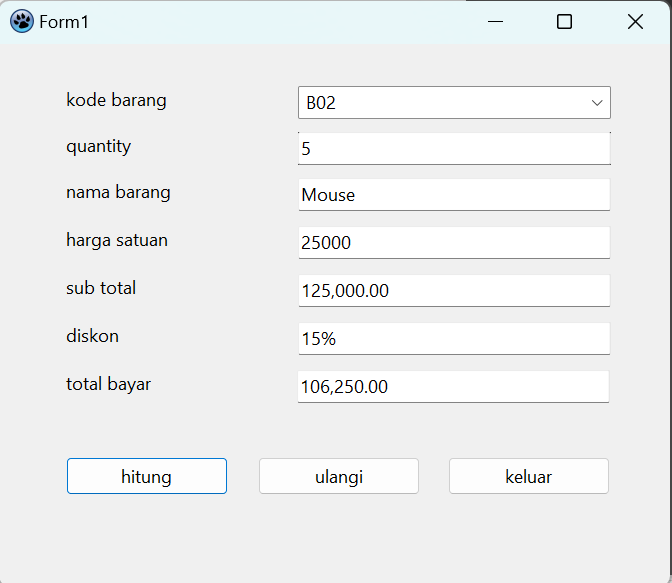
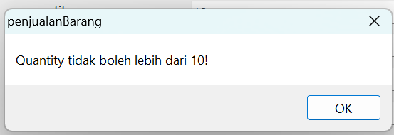

# Latihan2_Pemrograman_Visual
<strong>Repository ini dibuat untuk memenuhi tugas Pemrograman Visual</strong>
| <strong>Nama</strong>      | <strong>Riris Naomi Gurning</strong>  |
| ----------- | ----------- |
| <strong>NIM</strong>     | <strong>312010190</strong>       |
| <strong>Kelas</strong>   | <strong>TI.20.A.1</strong>        |
| <strong>Dosen Pengampu</strong> | <strong>Agung Nugroho, S.Kom., M.Kom.</strong> |

## 1. Program Menghitung Gaji Karyawan

Tampilan Utama

Hitung gaji pegawai dengan jabatan manager dengan status tetap, \*berlaku juga untuk lainnya

## 2. Program Penjualan Barang

Hitung penjualan barang dengan ketentuan:

- Data yang diinputkan hanya kode barang dan quantity.
- Quantity pembelian tidak boleh lebih dari 10.
- Data yang dimasukan harus divalidasi.

Tampilan Utama

Tampilan Ketika Data Yang Diinputkan Hanya Kode Barang(B02) Dan Quantity(5), \*berlaku juga untuk lainnya 

Tampilan Ketika Data Yang Diinputkan Hanya Kode Barang(B02) Dan Quantity(12), \*berlaku juga untuk lainnya

->Karena Quantity Lebih Dari 10 Maka Tampilan Akan Keluar Seperti Itu, \*berlaku juga untuk lainnya

